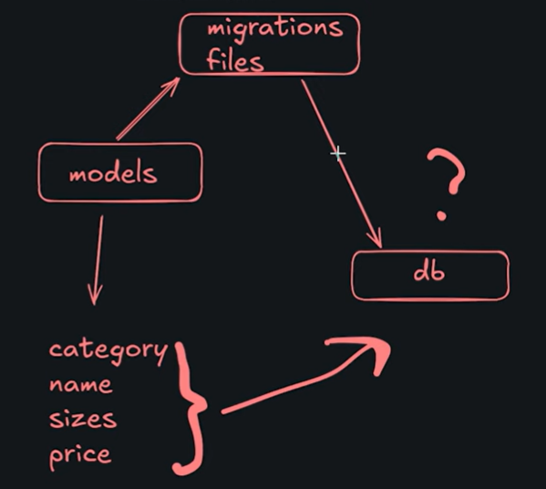

# COMMANDS #

### Start project/app ###

(python manage.py) django start(project/app) name

### Make migration ###

After we change models.py we need to make migration to our database. 
First we need to process our changes into new migrations file.

    python manage.py makemigrations

Then we can "migrate" this data to our database:

    python manage.py migrate


### Create virtual environment ###

python -m venv venv
venv/Scripts/activate

---------------------------------------------------------------------------------------------------------------------------------------------------------------------
# MODELS #

### How we set up data in db ###


In models.py we create our model with some data (category, name, etc.). Then it is translated 
to migration files and then sent to our db. Database then can deal with new data of that type.

### How to create model ###

In models.py wy create class which take over models.Model. We give our model some fields and __str__ method.
This method defines how we are going to see each of those models in admin panel.

### What if we want to have models as a parameter for another model? ###

In this case we want to tell model that this field is a defined model from above. we do it like this:

```
class Category(models.Model):
    name = models.CharField(max_length=100)
    
    def __str__(self):
        return self.name


class Product(models.Model):
    name = models.CharField(max_length=100)
    slug = models.CharField(max_length=100, unique=True)
    category = models.ForeignKey(Category, on_delete=models.CASCADE)
```
That way we create ForeignKey for our model/class and set delete method.

### What next ###

After we created our models we need to register them in admin.py.
To do it we create set of rules in class called NameOfOurModelAdmin and then register it in out admin panel.

    class ProductAdmin(admin.ModelAdmin):
        list_display = ['name', 'category', 'color', 'price']
        list_filter = ['category', 'color']
        search_fields = ['name', 'color', 'description']
        prepopulated_fields = {'slug': ('name',)}
        inlines = [ProductSizeInLine, ProductImageInLine]


    class CategoryAdmin(admin.ModelAdmin):
        list_display = ['name', 'slug']
        prepopulated_fields = {'slug': ('name',)}
    
    
    class SizeAdmin(admin.ModelAdmin):
        list_display = ['name']
    
    
    admin.site.register(Product, ProductAdmin)
    admin.site.register(Categry, CategoryAdmin)
    admin.site.register(Size, SizeAdmin)

---------------------------------------------------------------------------------------------------------------------------------------------------------------------

# VIEWS #
https://docs.djangoproject.com/en/6.0/topics/class-based-views/
In this project we use class based views. 

---------------------------------------------------------------------------------------------------------------------------------------------------------------------
# GENERAL NOTES #

### .env files ###
We use .env files to store critical data.

to load .env file to settings.py:
  - load_dotenv()

to access some data:
  - SECRET_KEY = os.getenv("SECRET_KEY")

### Static and media urls ###
Static files are used to store icons, logo and more "static data". In media we store links to photos 
or another content that we want to shw on our website (there is no reason to store all that files in project).


